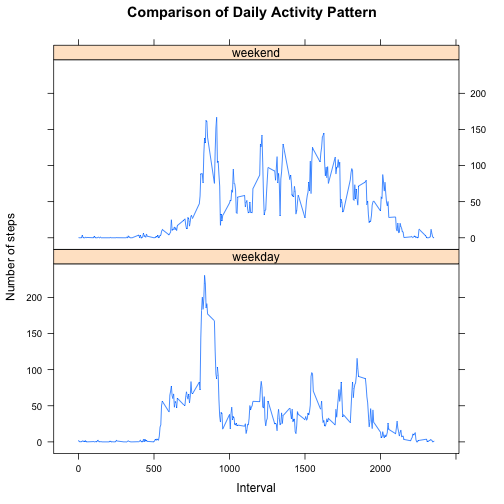

 Reproducible Research: Peer Assessment 1
==========================================
## Introduction

It is now possible to collect a large amount of data about personal movement using activity monitoring devices such as a Fitbit, Nike Fuelband, or Jawbone Up. These type of devices are part of the “quantified self” movement – a group of enthusiasts who take measurements about themselves regularly to improve their health, to find patterns in their behavior, or because they are tech geeks. But these data remain under-utilized both because the raw data are hard to obtain and there is a lack of statistical methods and software for processing and interpreting the data.

This assignment makes use of data from a personal activity monitoring device. This device collects data at 5 minute intervals through out the day. The data consists of two months of data from an anonymous individual collected during the months of October and November, 2012 and include the number of steps taken in 5 minute intervals each day.

## Data

*The data for this assignment can be downloaded from the course web site:*

  - Dataset: [Activity monitoring data](https://d396qusza40orc.cloudfront.net/repdata%2Fdata%2Factivity.zip) [52K]
  
The variables included in this dataset are:

  - steps: Number of steps taking in a 5-minute interval (missing values are coded as NA)

  - date: The date on which the measurement was taken in YYYY-MM-DD format

  - interval: Identifier for the 5-minute interval in which measurement was taken

The dataset is stored in a comma-separated-value (CSV) file and there are a total of 17,568 observations in this dataset.

## step 1: Loading and preprocessing the data

```r
# setwd("C:\\Users\\huangrh.FamilyHuang\\SkyDrive\\CS\\Course\\ds05_ReproducibleResearch\\RepData_PeerAssessment1")
setwd("/Users/huangrh/SkyDrive/CS/Course/ds05_ReproducibleResearch/RepData_PeerAssessment1")
dataset <- read.csv("activity.csv") # loading the data. unzip the data if you didn't do it. 
# processing the data if neccesary
```

## step 2: What is mean total number of steps taken per day?

2.1 Make a histogram of the total number of steps taken each day


```r
# calculate & plot
TotalByDay <-aggregate(steps~date, dataset, FUN="sum")
colnames(TotalByDay) <- c("date", "StepsByDay")
l <- length(TotalByDay[,1])
with(TotalByDay, hist(StepsByDay, breaks = l, main="The Total Number of Steps Per Day",
                      xlab="The Total Number of Steps Per Day"))
```

 

2.2 Calculate and report the mean and median for the total number of steps taken per day


```r
Mean <- mean(as.numeric(TotalByDay$StepsByDay))
Median <- median(as.numeric(TotalByDay$StepsByDay))
cat("The mean for the total number of steps per day is", Mean)
```

```
## The mean for the total number of steps per day is 10766
```

```r
cat("The median for the total number of steps per day is", Median)
```

```
## The median for the total number of steps per day is 10765
```
## step 3: What is the average daily activity pattern?

3.1 Make a time series plot (i.e. type = "l") of the 5-minute interval (on x-axis) and the average number of steps taken, averaged across all days (y-axis)


```r
#subdata$interval <- as.factor(subdata$interval)
dayPattern <- aggregate(steps~interval, dataset, FUN="mean")
dayPattern$interval <- ts(dayPattern$interval)
with(dayPattern, plot(interval, steps, type = "l", 
                      main="Daily Activity Pattern", 
                      ylab="Steps for a 5-min time interval", 
                      xlab="The begenning of the 5-min time interval"))
```

 

3.2 Which 5-minute interval, on average across all the days in the dataset, contains the maximum number of steps?

```r
Time <- dayPattern$interval[dayPattern$steps==max(dayPattern$steps)]
Time <- c(Time, Time+5)
Time = sapply(Time, function(x) {sub("((^[0-9]$)|([0-9][0-9]$))", ":\\1", x)}) # formatting. 
cat("Answers: The interval containing max number of steps is from ", Time[1], " to ", Time[2])
```

```
## Answers: The interval containing max number of steps is from  8:35  to  8:40
```

## Step 4: Imputing missing values

Note that there are a number of days/intervals where there are missing values (coded as NA). The presence of missing days may introduce bias into some calculations or summaries of the data.

4.1 Calculate and report the total number of missing values in the dataset (i.e. the total number of rows with NAs)

```r
cat("The total number of the missing values (i.e. the rows of NA) in the dataset is", sum(is.na(dataset$steps)))
```

```
## The total number of the missing values (i.e. the rows of NA) in the dataset is 2304
```

4.2 Devise a strategy for filling in all of the missing values in the dataset. The strategy does not need to be sophisticated. For example, you could use the mean/median for that day, or the mean for that 5-minute interval, etc.

    Create a new dataset that is equal to the original dataset but with the missing data filled in. Here the missing values (i.e. NAs) are filled with the mean for that specific 5-minute interval. 

```r
names(dayPattern)[2] <- "Mean"
imputedSet <- merge(dataset, dayPattern, by.x= "interval", by.y="interval")
imputedSet$steps[is.na(imputedSet$steps)] <- imputedSet$Mean[is.na(imputedSet$steps)]
imputedSet$Mean <- NULL
head(imputedSet, 5)
```

```
##   interval steps       date
## 1        0 1.717 2012-10-01
## 2        0 0.000 2012-11-23
## 3        0 0.000 2012-10-28
## 4        0 0.000 2012-11-06
## 5        0 0.000 2012-11-24
```

```r
str(imputedSet)
```

```
## 'data.frame':	17568 obs. of  3 variables:
##  $ interval: int  0 0 0 0 0 0 0 0 0 0 ...
##  $ steps   : num  1.72 0 0 0 0 ...
##  $ date    : Factor w/ 61 levels "2012-10-01","2012-10-02",..: 1 54 28 37 55 46 20 47 38 56 ...
```

4.3 Make a histogram of the total number of steps taken each day (using the imputed data)

```r
TotalByDayimputed <-aggregate(steps~date, imputedSet, FUN="sum")
colnames(TotalByDayimputed) <- c("date", "StepsByDay")
len<-length(TotalByDayimputed[,1])
with(TotalByDayimputed, hist(StepsByDay, breaks = len, xlab="The Total Daily Number of Steps",
                             main="The Total Daily Number of Steps After imputed the NAs"))
```

 

4.4 Calculate and report the mean and median total number of steps taken per day after imputing the missing data.

```r
 MeanImputed <- mean(as.numeric(TotalByDayimputed$StepsByDay))
 MedianImputed <- median(as.numeric(TotalByDayimputed$StepsByDay))
 cat("Mean after filling the NAs =", MeanImputed);  cat("Median after filling the NAs =", MedianImputed)
```

```
## Mean after filling the NAs = 10766
```

```
## Median after filling the NAs = 10766
```
4.5 Do these values differ from the estimates from the first part of the assignment? 
What is the impact of imputing missing data on the estimates of the total daily number of steps?
Answers: Yes, see the summary below. The tatal daily number of steps can be increased in lieu of imputing missing data. 

```r
summary(TotalByDay) # the data before imputing the missing data
```

```
##          date      StepsByDay   
##  2012-10-02: 1   Min.   :   41  
##  2012-10-03: 1   1st Qu.: 8841  
##  2012-10-04: 1   Median :10765  
##  2012-10-05: 1   Mean   :10766  
##  2012-10-06: 1   3rd Qu.:13294  
##  2012-10-07: 1   Max.   :21194  
##  (Other)   :47
```

```r
summary(TotalByDayimputed) # the data after imputing the missing data
```

```
##          date      StepsByDay   
##  2012-10-01: 1   Min.   :   41  
##  2012-10-02: 1   1st Qu.: 9819  
##  2012-10-03: 1   Median :10766  
##  2012-10-04: 1   Mean   :10766  
##  2012-10-05: 1   3rd Qu.:12811  
##  2012-10-06: 1   Max.   :21194  
##  (Other)   :55
```

## Step 5: Are there differences in activity patterns between weekdays and weekends?
Instructions: For this part the weekdays() function may be of some help here. Use the dataset with the filled-in missing values for this part.

5.1 Create a new factor variable "weekDay" in the dataset ("imputedSet") with two levels – “weekday” and “weekend” indicating whether a given date is a weekday or weekend day.

```r
imputedSet$weekDay <- sapply(weekdays(as.Date(imputedSet$date)), function(x) {
  if (x %in% c("Monday", "Tuesday", "Wednesday", "Thursday", "Friday")) {"weekday"}
  else {"weekend"}
})
imputedSet$weekDay <- as.factor(imputedSet$weekDay)
```

5.2 Make a panel plot containing a time series plot (i.e. type = "l") of the 5-minute interval (x-axis) and the average number of steps taken, averaged across all weekday days or weekend days (y-axis). The plot should look something like the following, which was creating using simulated data:


```r
weekdayPattern <- data.frame(aggregate(steps~interval, subset(imputedSet, weekDay == "weekday"), FUN="mean"),
                             weekDay=factor("weekday"))
weekendPattern <- data.frame(aggregate(steps~interval, subset(imputedSet, weekDay == "weekend"), FUN="mean"), 
                             weekDay=factor("weekend"))
mergePattern <- rbind(weekdayPattern, weekendPattern)
# use lattice plot. 
library(lattice)
xyplot(steps ~ interval|weekDay, data = mergePattern, type = "l", layout = c(1,2), 
       main="Comparison of Daily Activity Pattern", xlab="Interval", ylab = "Number of steps")
```

 
